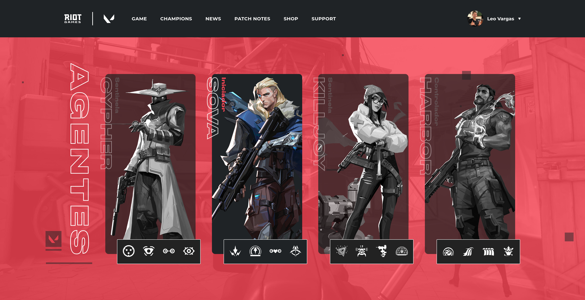

<h1 align="center">
  Valorant
</h1>

  

## 💻 Projeto

...

## 🚀 Tecnologias

-  [Next.js](https://nextjs.org/)
-  [Sass](https://sass-lang.com/)
-  [TypeScript](https://www.typescriptlang.org/)
-  [API Valorant](https://valorant-api.com/)

## 📔 Conhecimentos abordados

- [x] ITEM 1
- [x] ITEM 2
- [x] ITEM 3
- [x] ITEM 4

## 📝 Tema de casa

- [x] ITEM 1
- [x] ITEM 2
- [x] ITEM 3
- [x] ITEM 4

<!-- ## 📺 Tutorial no Youtube

 -->
